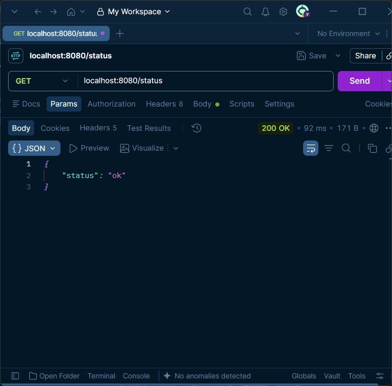
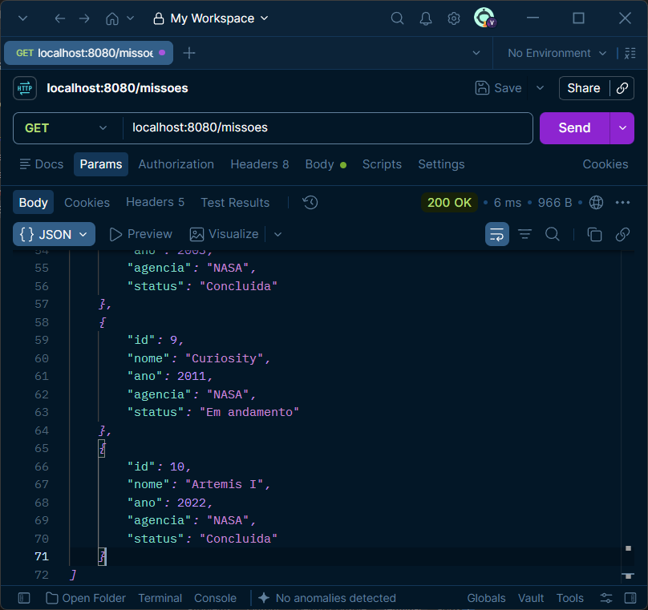
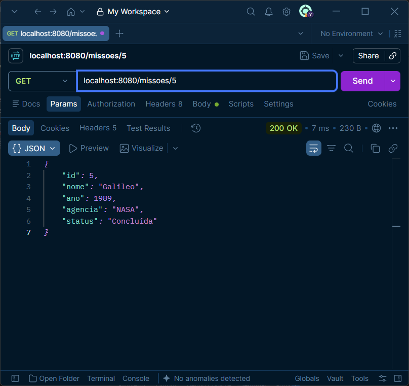
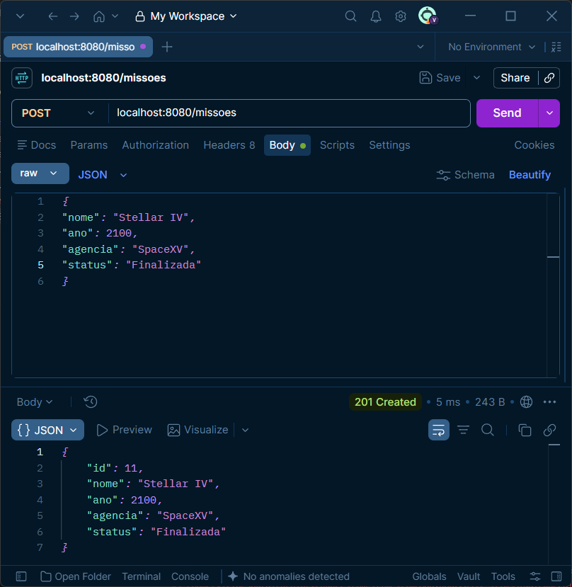
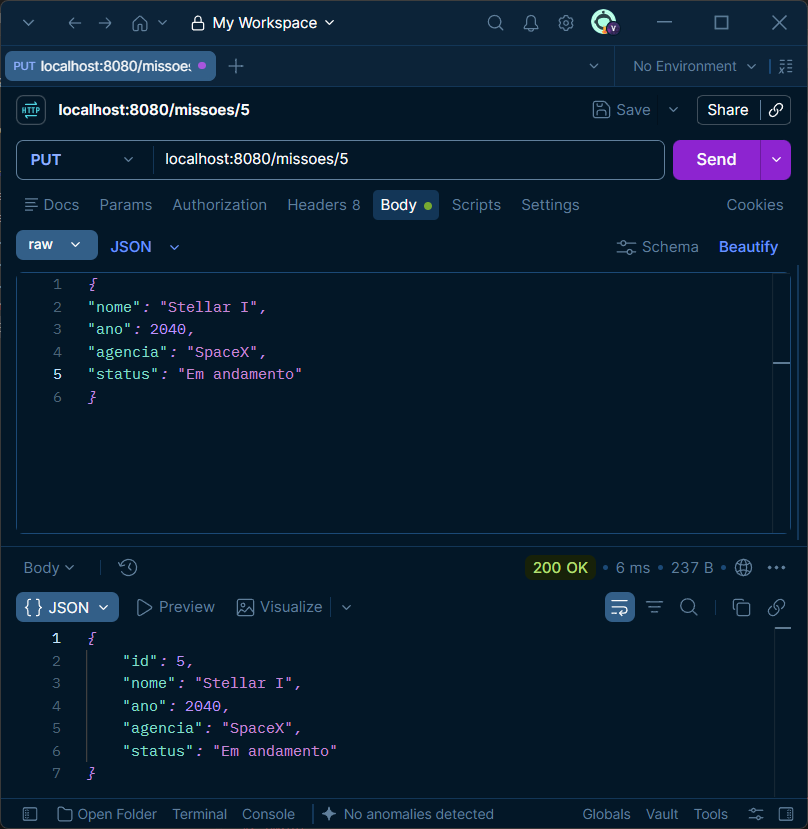
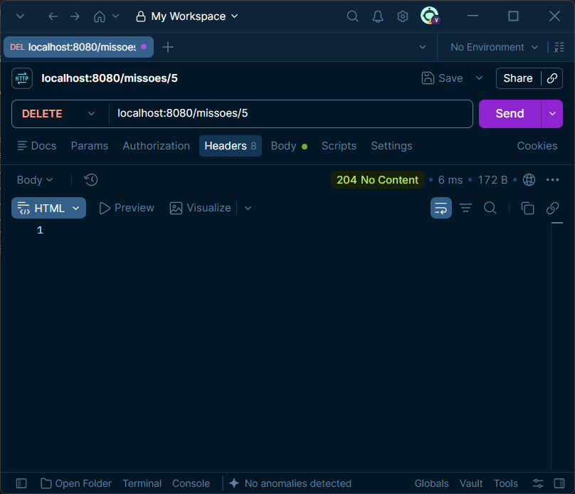

Nome: Victor Henrique Souza
Curso: Informática para Internet
UC: Desenvolver Serviços Web

Este projeto individual consiste no desenvolvimento de uma API para gerenciamento de missões espaciais. A API permite consultar, cadastrar, atualizar e excluir missões por meio de requisições HTTP, como GET, POST, PUT e DELETE (modelo CRUD).

Foram utilizadas as tecnologias:
* PHP
* Slim Framework
* Composer
* JSON

Para clonar o projeto, abra o Windows PowerShell e digite:
git clone https://github.com/chromekx/prova.git

Para instalar as dependências, abra o terminal do VS Code ou Windows PowerShell e digite:
* composer require slim/slim
e
* composer require slim/psr7

Para executar o projeto, digite:
* php -S localhost:8080 -t public

Testes do projeto:

* URL: localhost:8080/status
* Objetivo: Verificar se a API está funcionando corretamente.
* Ex. de Requisição: GET /status
* Ex. de Resposta: { "status": "ok" }

* URL: localhost:8080/missoes
* Objetivo: Consultar todas as missões cadastradas.
* Ex. de Requisição: GET /missoes
* Ex. de Resposta:
[
    {
        "id": 1,
        "nome": "Apollo 11",
        "ano": 1969,
        "agencia": "NASA",
        "status": "Concluida"
    },
    {
        "id": 2,
        "nome": "Apollo 13",
        "ano": 1970,
        "agencia": "NASA",
        "status": "Concluida"
    },
    {
        "id": 3,
        "nome": "Viking 1",
        "ano": 1975,
        "agencia": "NASA",
        "status": "Concluida"
    },
    {
        "id": 4,
        "nome": "Voyager 1",
        "ano": 1977,
        "agencia": "NASA",
        "status": "Em andamento"
    },
    {
        "id": 5,
        "nome": "Galileo",
        "ano": 1989,
        "agencia": "NASA",
        "status": "Concluida"
    },
    {
        "id": 6,
        "nome": "Mars Pathfinder",
        "ano": 1996,
        "agencia": "NASA",
        "status": "Concluida"
    },
    {
        "id": 7,
        "nome": "Cassini-Huygens",
        "ano": 1997,
        "agencia": "NASA/ESA/ASI",
        "status": "Concluida"
    },
    {
        "id": 8,
        "nome": "Mars Exploration Rover",
        "ano": 2003,
        "agencia": "NASA",
        "status": "Concluida"
    },
    {
        "id": 9,
        "nome": "Curiosity",
        "ano": 2011,
        "agencia": "NASA",
        "status": "Em andamento"
    },
    {
        "id": 10,
        "nome": "Artemis I",
        "ano": 2022,
        "agencia": "NASA",
        "status": "Concluida"
    }
]

* URL: localhost:8080/missoes/5
* Objetivo: Consultar uma missão específica utilizando seu ID.
* Ex. de Requisição: GET /missoes/5
* Ex. de Resposta:
{
    "id": 5,
    "nome": "Galileo",
    "ano": 1989,
    "agencia": "NASA",
    "status": "Concluida"
}

* URL: localhost:8080/missoes
* Objetivo: Cadastrar uma nova missão.
* Ex. de Requisição: POST /missoes
{
    "nome": "Stellar IV",
    "ano": 2100,
    "agencia": "SpaceXV",
    "status": "Finalizada"
}

* Ex. de Resposta:
{
    "nome": "Stellar IV",
    "ano": 2100,
    "agencia": "SpaceXV",
    "status": "Finalizada"
}

* URL: localhost:8080/missoes/8
* Objetivo: Atualizar uma missão já cadastrada.
* Ex. de Requisição: PUT /missoes/5
{
    "nome": "Stellar I",
    "ano": 2040,
    "agencia": "SpaceX",
    "status": "Em andamento"
}

* Ex. de Resposta:
{
    "nome": "Stellar I",
    "ano": 2040,
    "agencia": "SpaceX",
    "status": "Em andamento"
}

* URL: localhost:8080/missoes/5
* Objetivo: Deletar uma missão cadastrada.
* Ex. de Requisição: DELETE /missoes/5
* Ex. de Resposta: 1